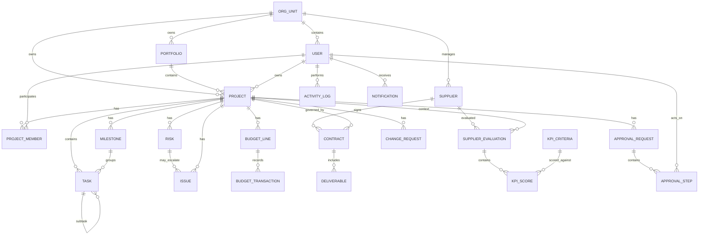

# MAIPT Project Management — Data Model & ERD V2 (SQLite-first)

> Bản hoàn thiện cho V1. Mục tiêu: nhẹ, dễ triển khai, chi phí thấp, nhưng vẫn sẵn sàng nâng cấp sang SQL Server bằng Entity Framework Core.

---

## 0. Quyết định database

### V1: SQLite

SQLite phù hợp cho MAIPT Project Management giai đoạn đầu vì:

- Không cần vận hành database server riêng.
- Database là một file, backup/restore đơn giản.
- Hỗ trợ tốt với ASP.NET Core + Entity Framework Core.
- Phù hợp internal app / MVP / nhóm user nhỏ đến trung bình.
- Không phát sinh license DB.
- Có thể migrate sang SQL Server khi tải tăng nếu business layer không viết phụ thuộc SQLite-specific SQL.

### Khi nào chuyển SQL Server

Chuyển khi có một hoặc nhiều điều kiện:

- Nhiều user ghi dữ liệu đồng thời.
- Nhiều hệ thống tích hợp cùng đọc/ghi DB.
- Cần HA/failover/replication/auditing enterprise.
- Khối lượng transaction, report hoặc BI tăng mạnh.
- Hệ thống trở thành platform dùng chung cho nhiều SBU.
- Cần tích hợp sâu Microsoft ecosystem.

### Vì sao không bắt buộc PostgreSQL

PostgreSQL là database server rất tốt, nhưng MAIPT-PM V1 chưa cần thêm một server DB riêng. PostgreSQL chỉ thực sự có lợi khi cần concurrency cao, JSON/search mạnh, cloud-native hoặc workload lớn. Với định hướng .NET/Microsoft, lộ trình `SQLite -> SQL Server` tự nhiên hơn.

---

## 1. Nguyên tắc thiết kế V2

1. Multi-organization ngay từ đầu bằng `ORG_UNIT`.
2. Portfolio quản trị nhiều Project.
3. Supplier và Project liên kết qua Contract.
4. Risk và Issue tách riêng; Issue có thể phát sinh từ Risk.
5. Budget có Baseline / Revised / Committed / Actual / Forecast.
6. Supplier KPI phải version hóa và snapshot trọng số để không phá lịch sử.
7. Approval được tách thành workflow, không chỉ rải `approved_by`.
8. Document dùng polymorphic link `entity_type + entity_id`.
9. Activity Log append-only.
10. Tiền lưu `INTEGER`, không dùng floating point.
11. RBAC enforce ở API/backend.
12. Mọi bảng nghiệp vụ chính có `created_at`, `updated_at` và các index phù hợp.

---

## 2. ERD tổng thể



---

## 3. Organization & Users

### ORG_UNIT

| Field | Type | Note |
|---|---|---|
| id | INTEGER PK | Auto increment |
| code | TEXT | Unique |
| name | TEXT | |
| parent_id | INTEGER FK | nullable |
| type | TEXT | COMPANY/SBU/DIVISION/DEPARTMENT |
| status | TEXT | ACTIVE/INACTIVE |
| created_at | TEXT | ISO datetime |
| updated_at | TEXT | ISO datetime |

### USER

| Field | Type |
|---|---|
| id | INTEGER PK |
| org_unit_id | INTEGER FK |
| name | TEXT |
| email | TEXT UNIQUE |
| job_title | TEXT |
| department | TEXT |
| role | TEXT |
| status | TEXT |
| created_at | TEXT |
| updated_at | TEXT |

Role V1: `ADMIN / CIO / PM / PROCUREMENT / FINANCE / RISK_OWNER / MEMBER / VIEWER`.

---

## 4. Portfolio & Project

### PORTFOLIO

| Field | Type |
|---|---|
| id | INTEGER PK |
| org_unit_id | INTEGER FK |
| code | TEXT |
| name | TEXT |
| owner_id | INTEGER FK |
| description | TEXT |
| status | TEXT |
| created_at | TEXT |
| updated_at | TEXT |

### PROJECT

| Field | Type |
|---|---|
| id | INTEGER PK |
| org_unit_id | INTEGER FK |
| portfolio_id | INTEGER FK |
| code | TEXT |
| name | TEXT |
| description | TEXT |
| owner_id | INTEGER FK |
| sponsor_id | INTEGER FK nullable |
| status | TEXT |
| priority | TEXT |
| start_date | TEXT |
| end_date | TEXT |
| baseline_end_date | TEXT |
| budget_amount | INTEGER |
| currency | TEXT |
| progress_pct | INTEGER |
| health_score | REAL |
| health_status | TEXT |
| created_at | TEXT |
| updated_at | TEXT |
| archived_at | TEXT nullable |

Status: `DRAFT / PLANNING / ACTIVE / ON_HOLD / COMPLETED / CANCELLED / ARCHIVED`.

Health: `GREEN / AMBER / RED`.

### PROJECT_MEMBER

| Field | Type |
|---|---|
| id | INTEGER PK |
| project_id | INTEGER FK |
| user_id | INTEGER FK |
| project_role | TEXT |
| allocation_pct | INTEGER |
| start_date | TEXT |
| end_date | TEXT |
| is_active | INTEGER |

Constraint: `UNIQUE(project_id, user_id, project_role)`.

---

## 5. Task & Milestone

### MILESTONE

| Field | Type |
|---|---|
| id | INTEGER PK |
| project_id | INTEGER FK |
| name | TEXT |
| description | TEXT |
| due_date | TEXT |
| actual_date | TEXT nullable |
| status | TEXT |
| weight_pct | REAL |
| created_at | TEXT |
| updated_at | TEXT |

### TASK

| Field | Type |
|---|---|
| id | INTEGER PK |
| project_id | INTEGER FK |
| parent_task_id | INTEGER FK nullable |
| milestone_id | INTEGER FK nullable |
| code | TEXT |
| name | TEXT |
| description | TEXT |
| assignee_id | INTEGER FK nullable |
| status | TEXT |
| priority | TEXT |
| start_date | TEXT |
| due_date | TEXT |
| completed_date | TEXT nullable |
| progress_pct | INTEGER |
| estimated_hours | REAL |
| actual_hours | REAL |
| sort_order | INTEGER |
| created_at | TEXT |
| updated_at | TEXT |

Task Status: `TODO / IN_PROGRESS / BLOCKED / REVIEW / DONE / CANCELLED`.

Priority: `LOW / MEDIUM / HIGH / CRITICAL`.

---

## 6. Risk & Issue

### RISK

| Field | Type |
|---|---|
| id | INTEGER PK |
| project_id | INTEGER FK |
| code | TEXT |
| category | TEXT |
| title | TEXT |
| description | TEXT |
| probability | INTEGER |
| impact | INTEGER |
| severity_score | INTEGER |
| owner_id | INTEGER FK |
| response_strategy | TEXT |
| mitigation_plan | TEXT |
| contingency_plan | TEXT |
| target_date | TEXT |
| status | TEXT |
| created_at | TEXT |
| updated_at | TEXT |

`severity_score = probability x impact`, thang 1-5.

### ISSUE

| Field | Type |
|---|---|
| id | INTEGER PK |
| project_id | INTEGER FK |
| risk_id | INTEGER FK nullable |
| code | TEXT |
| title | TEXT |
| description | TEXT |
| category | TEXT |
| severity | TEXT |
| status | TEXT |
| reported_by | INTEGER FK |
| assigned_to | INTEGER FK nullable |
| reported_date | TEXT |
| target_resolution_date | TEXT |
| resolved_date | TEXT nullable |
| resolution | TEXT |
| created_at | TEXT |
| updated_at | TEXT |

---

## 7. Budget & Cost Control

### BUDGET_LINE

| Field | Type |
|---|---|
| id | INTEGER PK |
| project_id | INTEGER FK |
| code | TEXT |
| category | TEXT |
| description | TEXT |
| baseline_amount | INTEGER |
| revised_amount | INTEGER |
| committed_amount | INTEGER |
| actual_amount | INTEGER |
| forecast_amount | INTEGER |
| currency | TEXT |
| created_at | TEXT |
| updated_at | TEXT |

Dashboard metrics:

- Budget Variance = `revised_amount - actual_amount`
- Forecast Variance = `revised_amount - forecast_amount`
- Utilization % = `actual_amount / revised_amount * 100`

### BUDGET_TRANSACTION

| Field | Type |
|---|---|
| id | INTEGER PK |
| budget_line_id | INTEGER FK |
| contract_id | INTEGER FK nullable |
| type | TEXT |
| reference_no | TEXT |
| description | TEXT |
| amount | INTEGER |
| currency | TEXT |
| txn_date | TEXT |
| status | TEXT |
| requested_by | INTEGER FK |
| approved_by | INTEGER FK nullable |
| approved_at | TEXT nullable |
| created_at | TEXT |

Type: `COMMITMENT / ACTUAL / ADJUSTMENT / FORECAST`.

---

## 8. Supplier, Contract & Deliverable

### SUPPLIER

| Field | Type |
|---|---|
| id | INTEGER PK |
| org_unit_id | INTEGER FK |
| code | TEXT |
| name | TEXT |
| tax_code | TEXT |
| category | TEXT |
| contact_name | TEXT |
| email | TEXT |
| phone | TEXT |
| address | TEXT |
| status | TEXT |
| rating | REAL |
| created_at | TEXT |
| updated_at | TEXT |

Status: `PROSPECT / QUALIFIED / ACTIVE / SUSPENDED / BLACKLISTED / INACTIVE`.

### CONTRACT

| Field | Type |
|---|---|
| id | INTEGER PK |
| project_id | INTEGER FK |
| supplier_id | INTEGER FK |
| contract_number | TEXT |
| title | TEXT |
| description | TEXT |
| contract_type | TEXT |
| value | INTEGER |
| currency | TEXT |
| signed_date | TEXT |
| start_date | TEXT |
| end_date | TEXT |
| owner_id | INTEGER FK |
| status | TEXT |
| created_at | TEXT |
| updated_at | TEXT |

### DELIVERABLE

| Field | Type |
|---|---|
| id | INTEGER PK |
| contract_id | INTEGER FK |
| milestone_id | INTEGER FK nullable |
| name | TEXT |
| description | TEXT |
| due_date | TEXT |
| submitted_date | TEXT nullable |
| accepted_date | TEXT nullable |
| accepted_by | INTEGER FK nullable |
| status | TEXT |
| completion_pct | INTEGER |
| created_at | TEXT |
| updated_at | TEXT |

---

## 9. Supplier KPI V2

### KPI_CRITERIA

| Field | Type |
|---|---|
| id | INTEGER PK |
| code | TEXT |
| name | TEXT |
| category | TEXT |
| weight_pct | REAL |
| description | TEXT |
| version | INTEGER |
| effective_from | TEXT |
| effective_to | TEXT nullable |
| is_active | INTEGER |

Seed V1:

| KPI | Weight |
|---|---:|
| On-time Delivery | 20% |
| Quality | 20% |
| Cost Performance | 15% |
| Responsiveness | 10% |
| Compliance | 15% |
| Issue Resolution | 10% |
| Documentation | 10% |
| **Total** | **100%** |

### SUPPLIER_EVALUATION

| Field | Type |
|---|---|
| id | INTEGER PK |
| supplier_id | INTEGER FK |
| project_id | INTEGER FK |
| contract_id | INTEGER FK nullable |
| period_type | TEXT |
| period_start | TEXT |
| period_end | TEXT |
| evaluator_id | INTEGER FK |
| overall_score | REAL |
| rating | TEXT |
| status | TEXT |
| submitted_at | TEXT nullable |
| approved_by | INTEGER FK nullable |
| approved_at | TEXT nullable |
| created_at | TEXT |

### KPI_SCORE

| Field | Type |
|---|---|
| id | INTEGER PK |
| evaluation_id | INTEGER FK |
| criteria_id | INTEGER FK |
| criteria_name_snapshot | TEXT |
| weight_pct_snapshot | REAL |
| score | REAL |
| weighted_score | REAL |
| evidence_url | TEXT |
| comment | TEXT |

Snapshot là bắt buộc để thay đổi bộ KPI/trọng số ở kỳ mới không làm thay đổi điểm lịch sử.

`weighted_score = score * weight_pct_snapshot / 100`

`overall_score = SUM(weighted_score)`

Rating:

- >=4.50: EXCELLENT
- >=4.00: VERY_GOOD
- >=3.00: ACCEPTABLE
- >=2.00: NEEDS_IMPROVEMENT
- <2.00: POOR

---

## 10. Change Request

### CHANGE_REQUEST

| Field | Type |
|---|---|
| id | INTEGER PK |
| project_id | INTEGER FK |
| code | TEXT |
| title | TEXT |
| description | TEXT |
| requested_by | INTEGER FK |
| request_date | TEXT |
| change_type | TEXT |
| reason | TEXT |
| scope_impact | TEXT |
| schedule_impact_days | INTEGER |
| cost_impact | INTEGER |
| risk_impact | TEXT |
| status | TEXT |
| decision | TEXT |
| decided_by | INTEGER FK nullable |
| decided_at | TEXT nullable |
| created_at | TEXT |
| updated_at | TEXT |

Status: `DRAFT / SUBMITTED / UNDER_REVIEW / APPROVED / REJECTED / IMPLEMENTED / CANCELLED`.

---

## 11. Approval Workflow

### APPROVAL_REQUEST

| Field | Type |
|---|---|
| id | INTEGER PK |
| project_id | INTEGER FK nullable |
| entity_type | TEXT |
| entity_id | INTEGER |
| workflow_type | TEXT |
| requested_by | INTEGER FK |
| requested_at | TEXT |
| status | TEXT |
| completed_at | TEXT nullable |

### APPROVAL_STEP

| Field | Type |
|---|---|
| id | INTEGER PK |
| approval_request_id | INTEGER FK |
| step_no | INTEGER |
| approver_id | INTEGER FK |
| status | TEXT |
| comment | TEXT |
| acted_at | TEXT nullable |

Status: `PENDING / APPROVED / REJECTED / SKIPPED`.

V1 có thể dùng 1-step approval nhưng schema đã sẵn sàng cho multi-step.

---

## 12. Document Management

### DOCUMENT

| Field | Type |
|---|---|
| id | INTEGER PK |
| org_unit_id | INTEGER FK |
| entity_type | TEXT |
| entity_id | INTEGER |
| category | TEXT |
| name | TEXT |
| original_file_name | TEXT |
| file_path | TEXT |
| mime_type | TEXT |
| file_size | INTEGER |
| version | INTEGER |
| checksum | TEXT |
| uploaded_by | INTEGER FK |
| uploaded_at | TEXT |
| is_current | INTEGER |
| status | TEXT |

Có thể gắn với Project, Task, Milestone, Risk, Issue, Supplier, Contract, Deliverable, Change Request và Supplier Evaluation.

Database chỉ giữ metadata/path; file thật nên để SharePoint, object storage hoặc storage riêng của backend.

---

## 13. Notifications

### NOTIFICATION

| Field | Type |
|---|---|
| id | INTEGER PK |
| user_id | INTEGER FK |
| project_id | INTEGER FK nullable |
| type | TEXT |
| severity | TEXT |
| title | TEXT |
| message | TEXT |
| entity_type | TEXT |
| entity_id | INTEGER nullable |
| is_read | INTEGER |
| created_at | TEXT |
| read_at | TEXT nullable |

Rule engine đề xuất:

- Milestone còn <=7 ngày chưa hoàn thành.
- Task overdue.
- Forecast vượt revised budget.
- Risk HIGH/CRITICAL.
- Issue CRITICAL chưa xử lý.
- Contract sắp hết hạn.
- Deliverable overdue.
- Supplier KPI <3.0.
- Approval pending quá SLA.

---

## 14. Audit Trail

### ACTIVITY_LOG

| Field | Type |
|---|---|
| id | INTEGER PK |
| user_id | INTEGER FK nullable |
| action | TEXT |
| entity_type | TEXT |
| entity_id | INTEGER |
| project_id | INTEGER FK nullable |
| old_values_json | TEXT |
| new_values_json | TEXT |
| ip_address | TEXT |
| user_agent | TEXT |
| timestamp | TEXT |

Actions: `CREATE / UPDATE / DELETE / APPROVE / REJECT / LOGIN / EXPORT / UPLOAD`.

Activity Log là append-only, không sửa/xóa qua UI.

---

## 15. RBAC V2

| Module | ADMIN/CIO | PM | Procurement | Finance | Member | Viewer |
|---|---|---|---|---|---|---|
| Dashboard | Full | Full | Read | Read | Read | Read |
| Portfolio | Full | Read | Read | Read | Read | Read |
| Project | Full | Own/Assigned | Read | Read | Assigned | Read |
| Tasks/Milestones | Full | Full Project | Read | Read | Assigned | Read |
| Risk/Issue | Full | Full Project | Read | Read | Assigned | Read |
| Budget | Full | Manage Project | Read | Full | Read limited | Read limited |
| Supplier | Full | Read | Full | Read | Read | Read |
| Contract | Full | Manage Project | Full | Full/Read | Read | Read |
| Supplier KPI | Full | Evaluate | Full | Read | - | Read |
| Change Request | Full | Full Project | Read | Read | Request | Read |
| Approval | Full | Submit | Submit | Submit/Approve | - | - |
| Settings | Full | - | - | - | - | - |
| Audit Log | Full | Project Read | - | Finance Read | - | - |

---

## 16. Executive Dashboard

KPI chính:

- Total Projects
- Active Projects
- Green / Amber / Red Projects
- Portfolio Progress
- Approved Budget
- Committed Cost
- Actual Cost
- Forecast Cost
- Budget Variance
- Open Risks / Critical Risks
- Open Issues / Critical Issues
- Overdue Tasks
- Upcoming Milestones
- Active Contracts
- Contracts Expiring Soon
- Supplier Average KPI
- Suppliers Below Threshold

Project Health đề xuất:

```text
Schedule Health     30%
Budget Health       25%
Risk Health         20%
Issue Health        10%
Deliverable Health  15%
                   ----
                   100%
```

---

## 17. Index bắt buộc

```text
project.org_unit_id
project.portfolio_id
project.owner_id
project.status

task.project_id
task.assignee_id
task.status
task.due_date

milestone.project_id
milestone.due_date

risk.project_id
risk.status
risk.severity_score

issue.project_id
issue.status
issue.severity

budget_line.project_id
budget_transaction.budget_line_id

contract.project_id
contract.supplier_id
contract.end_date

deliverable.contract_id
deliverable.due_date

supplier_evaluation.supplier_id
supplier_evaluation.project_id
supplier_evaluation.period_end

notification.user_id
notification.is_read

activity_log.entity_type
activity_log.entity_id
activity_log.project_id
activity_log.timestamp
```

---

## 18. SQLite implementation rules

### ID

```sql
INTEGER PRIMARY KEY AUTOINCREMENT
```

### Date/Datetime

Lưu ISO-8601, ví dụ:

```text
2026-08-16
2026-08-16T09:30:00+07:00
```

### Boolean

`0 = false`, `1 = true`.

### Money

Không lưu tiền bằng `REAL`. Dùng `INTEGER` theo đơn vị nhỏ nhất. Với VND có thể lưu trực tiếp số đồng.

### KPI scores

Có thể dùng `REAL` vì không phải transaction tài chính.

### Enum

SQLite không có enum native; lưu `TEXT` để dễ đọc và dễ migrate.

### Foreign Keys

Bật `PRAGMA foreign_keys = ON` khi khởi tạo connection.

### Concurrency

Bật WAL mode cho production nhỏ:

```sql
PRAGMA journal_mode = WAL;
```

---

## 19. SQL Server migration compatibility

ASP.NET Core dùng provider theo environment:

```text
Development / lightweight:
Microsoft.EntityFrameworkCore.Sqlite

Enterprise:
Microsoft.EntityFrameworkCore.SqlServer
```

Entities, services và API contracts không đổi.

Không dùng SQLite trigger hoặc SQLite-specific SQL để chứa business rules quan trọng.

---

## 20. Sidebar / Application Modules

```text
Dashboard

Portfolio
Projects
  ├─ Overview
  ├─ Tasks
  ├─ Milestones
  ├─ Budget
  ├─ Risks
  ├─ Issues
  ├─ Team
  ├─ Documents
  └─ Change Requests

Suppliers
  ├─ Supplier Directory
  ├─ Contracts
  ├─ Deliverables
  └─ Supplier KPI

Approvals
Reports
Documents
Notifications

Administration
  ├─ Organizations
  ├─ Users
  ├─ KPI Criteria
  ├─ Master Data
  ├─ RBAC
  └─ Audit Log
```

---

## 21. Thay đổi chính so với bản trước

| Nội dung | Bản trước | V2 |
|---|---|---|
| Multi-SBU | Mới chỉ đề xuất | Có ORG_UNIT trong schema |
| Resource | RESOURCE_ALLOCATION | PROJECT_MEMBER + allocation |
| Project | Basic | Sponsor, priority, baseline, health, archive |
| Milestone | Có quan hệ nhưng thiếu model chi tiết | Hoàn thiện entity |
| Supplier KPI | Weighted score | Version + snapshot |
| Approval | approved_by rải rác | APPROVAL_REQUEST + APPROVAL_STEP |
| Budget | Baseline/Revised/Actual | +Committed +Forecast |
| Change | Basic | Scope/Schedule/Cost/Risk impact |
| Document | Basic polymorphic | Version/metadata/checksum |
| Audit | Basic | old/new JSON + request context |
| Notification | Basic | Severity/entity/rule engine |
| DB | SQL Server/PostgreSQL | SQLite-first, SQL Server-ready |

---

## 22. MVP scope

### Phase 1 — Core

1. Login/User/Role
2. Organization
3. Portfolio
4. Project
5. Task
6. Milestone
7. Dashboard

### Phase 2 — Project Control

8. Risk
9. Issue
10. Budget
11. Change Request
12. Notification

### Phase 3 — Supplier

13. Supplier
14. Contract
15. Deliverable
16. Supplier KPI
17. Approval

### Phase 4 — Governance

18. Document
19. Audit Log
20. Reports
21. Advanced RBAC

---

## 23. Technology stack đề xuất

```text
Frontend
React + Vite + TypeScript
Tailwind CSS
Recharts

Backend
ASP.NET Core 8 Web API
Entity Framework Core
JWT/Cookie Authentication

Database V1
SQLite

Database Enterprise
SQL Server

Source Control
GitHub

Deployment
Frontend: Cloudflare Pages
Backend: ASP.NET hosting/container có persistent storage
Database: SQLite đặt cùng persistent storage của backend
```

**Quan trọng:** Cloudflare Pages chỉ host frontend/static assets. SQLite phải nằm trên backend có persistent disk. Không đặt file SQLite trực tiếp trên Cloudflare Pages.

---

## 24. Kiến trúc mục tiêu

```text
project.maipt.org
       |
React/Vite Frontend
       |
ASP.NET Core 8 API
       |
     SQLite
       |
Entity Framework Core
       |
SQL Server later
```

Đây là cấu trúc V2 được chốt cho MAIPT Project Management V1.
